# The Pictures and Plots From the Experimentation
## The Plots 
### The Environment with an Object
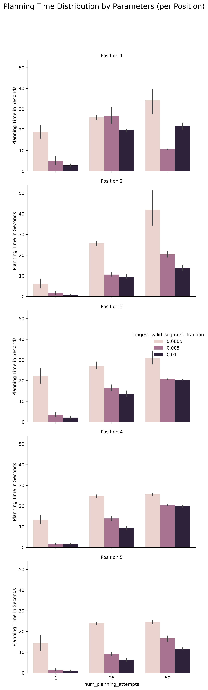
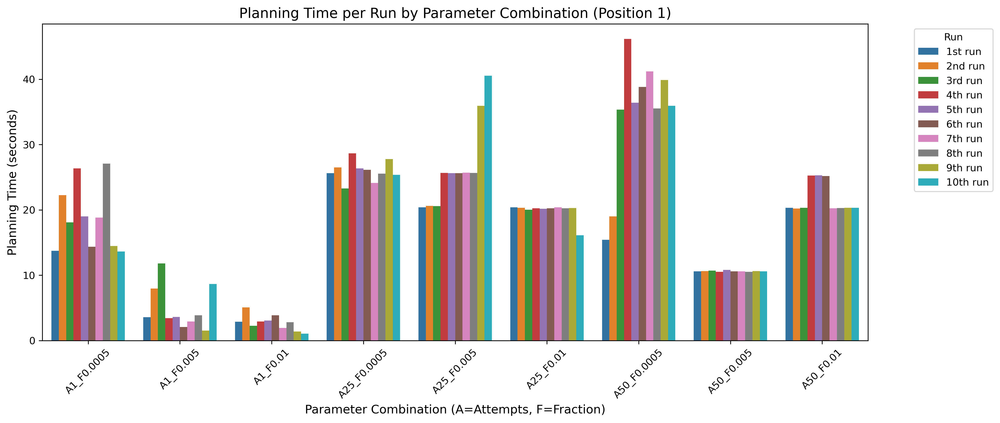
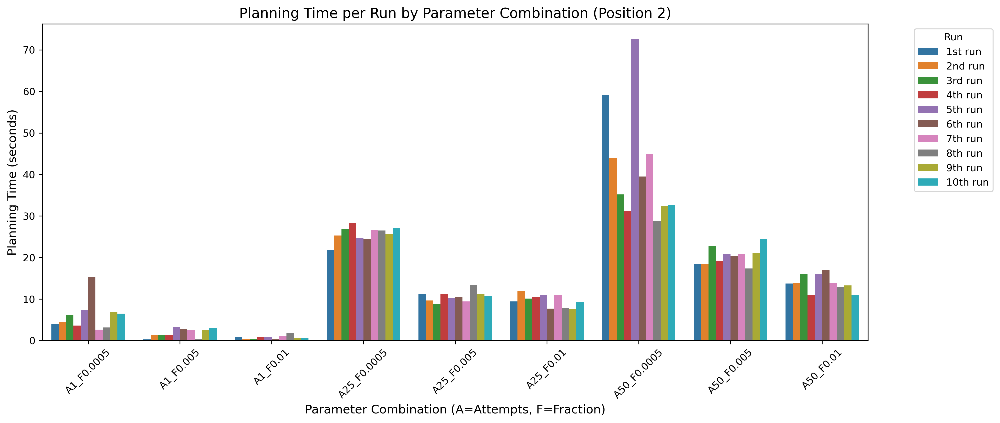
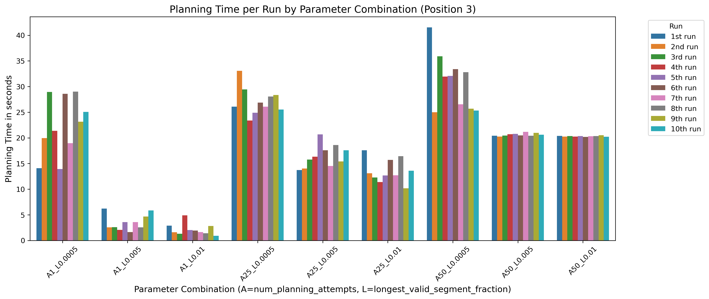
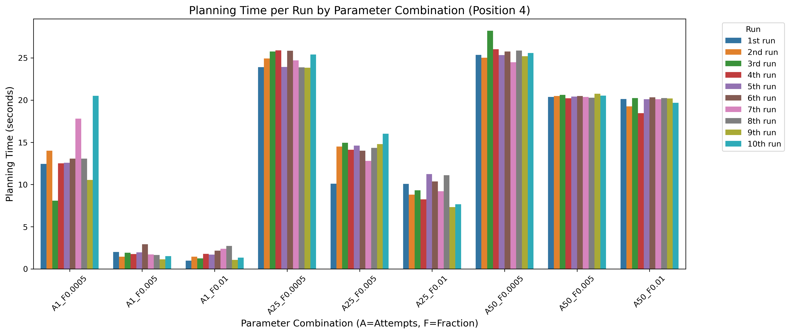
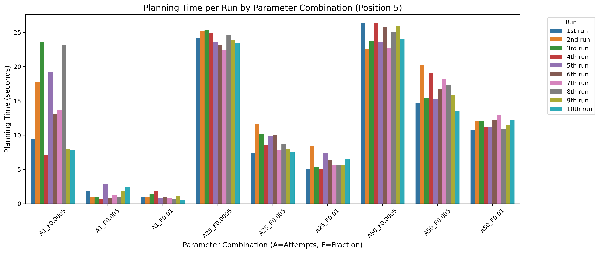

### The Environment without an Object
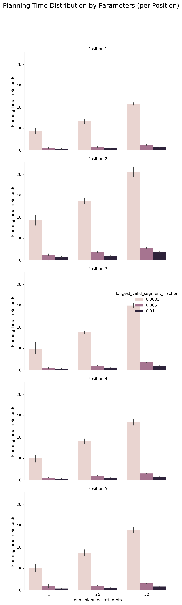
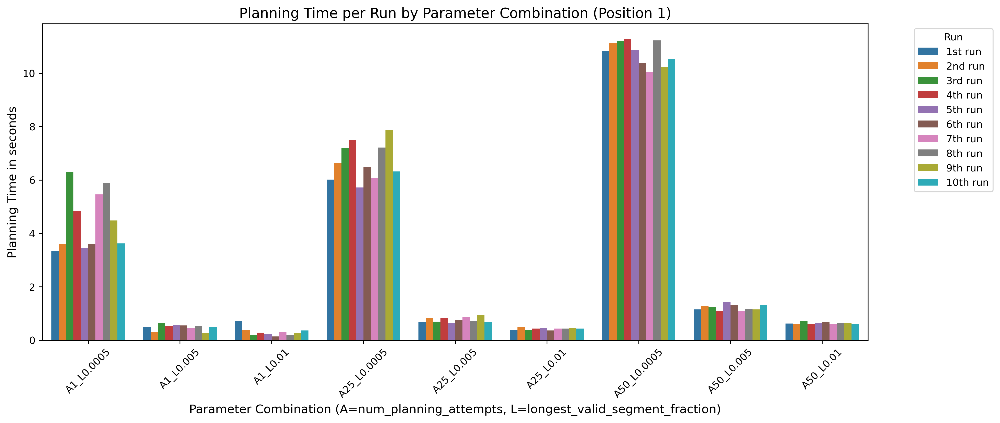
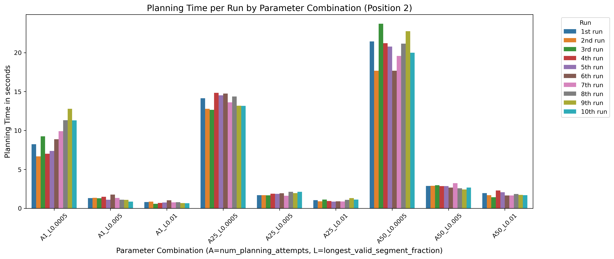
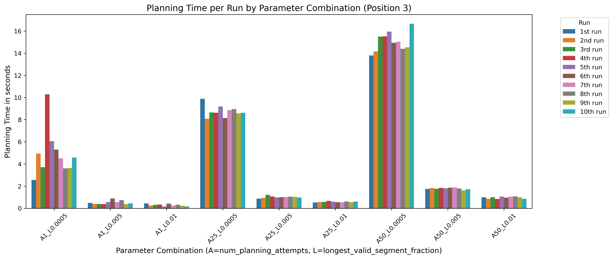
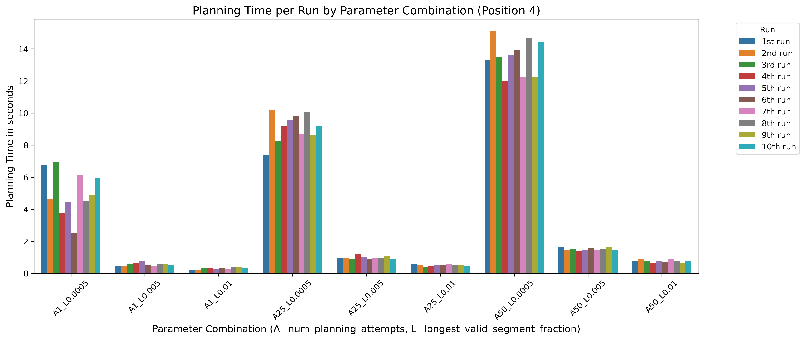
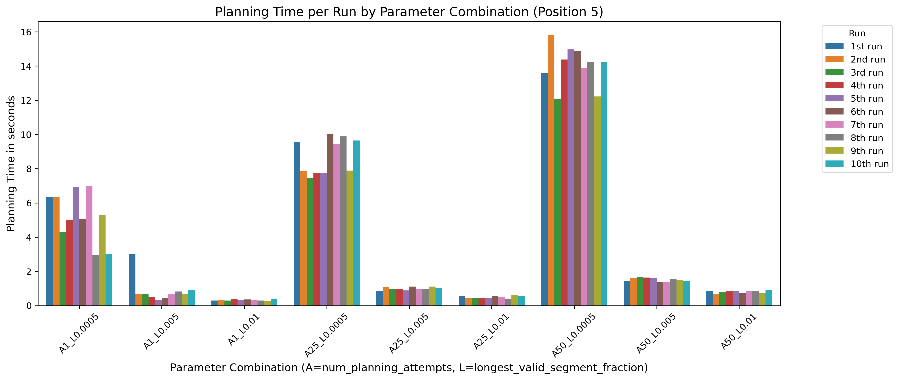
## The Pictures of Positions
### The Environment with an Object
### The Environment without an Object

