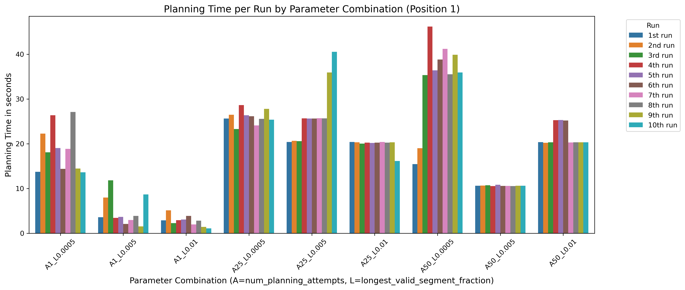
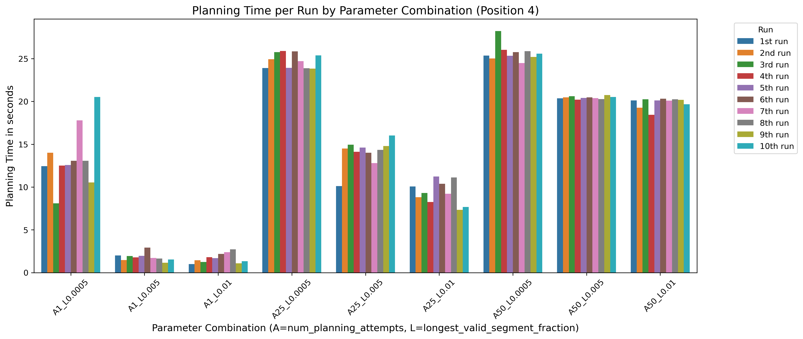
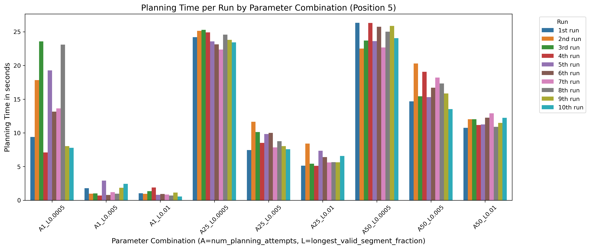

# The Pictures and Plots From the Experimentation
## The Plots 
### The Environment with an Object

### The Environment without an Object

## The Pictures of Positions
### The Environment with an Object
### The Environment without an Object

